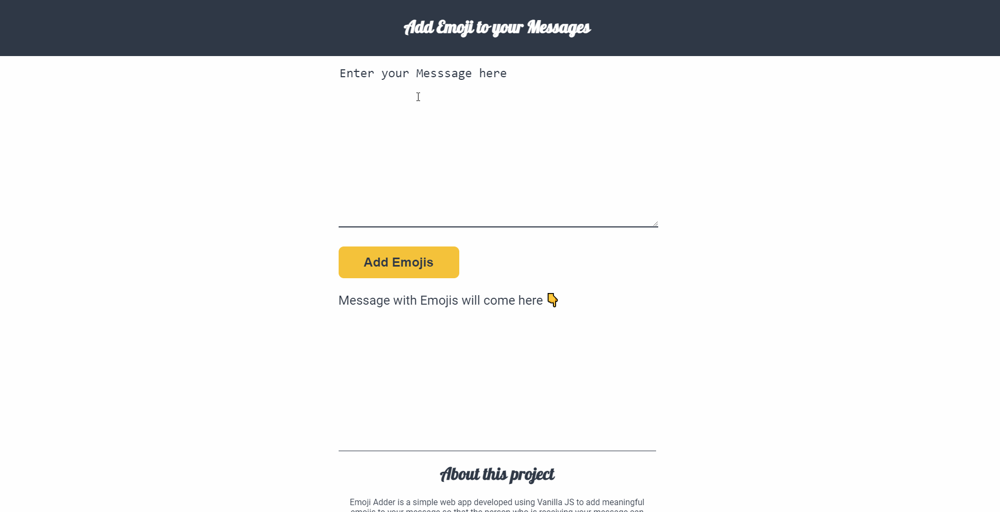

<h1 align="center" id="top">Welcome to Emoji Adder 👋</h1>

# Basic Overview

> This project is a simple responsive website used to add [emojis](https://en.wikipedia.org/wiki/Emoji) to a simple message in english language to make it more understandable for the user.

 

# Table of Contents

- [Description](#description)
- [Technologies Used](#technologies)
- [How to use](#How-to-use)
- [References](#references)
- [License](#license)
- [ToDos](#To-Dos)
- [Related Projects](#related-projects)
- [Support](#support)
- [Author Info](#author-info)

 

# Description

A simple and easy to use responsive website created using HTML5, CSS, javascript and [fun translation API](https://funtranslations.com/) to add images to your message in simple english language to make it more understandable to the user. Emoji or Emojis are pictograms, logograms, ideograms and smileys used in electronic messages and web pages. The emoji's primary function is to fill in emotional cues otherwise missing from typed conversation.

[Live Demo](https://codersaty.github.io/EmojiAdder/)

 

# Technologies

- [HTML5](https://en.wikipedia.org/wiki/HTML5)
- [CSS3](https://en.wikipedia.org/wiki/CSS)
- [JavaScript](https://en.wikipedia.org/wiki/JavaScript)
- [Git](https://en.wikipedia.org/wiki/Git)
- [Markdown](https://en.wikipedia.org/wiki/Markdown)

### Tools used

- [VS Code](https://en.wikipedia.org/wiki/Visual_Studio_Code)
- [Github](https://en.wikipedia.org/wiki/GitHub)

 

# How to Use

- Write your message in place of "Enter Your Message Here" in english language.

- Hit the Add Emojis button

- The message with emojis to add emotion to your message will appear below the Add Emojis button.

# References

I have used the following resources in creation of this project:

- [JavaScript in the browser!](https://www.youtube.com/watch?v=yLZazznWoAs&list=PLzvhQUIpvvuj5KPnyPyWsvgyzNkX_ACPA&index=6)

- [Emoji translator API](https://funtranslations.com/emoji)

 

# License

[MIT License](LICENSE.md)

Copyright (c) 2021 @[codersaty](http://codersaty.me)

 

# To Dos

> Thinking About it.

 

# Related Projects

> I will add the projects soon.

 

# Support

In case of any problem/ query, feel free to do pull requests or contact the author.

 

# Author Info

- Twitter - [@codersaty](https://twitter.com/codersaty)
- Website - [Anuranjan Srivastava](http://codersaty.me)
- Linkedin - [codersaty](https://www.linkedin.com/in/codersaty)

 

[Back To The Top](#top)